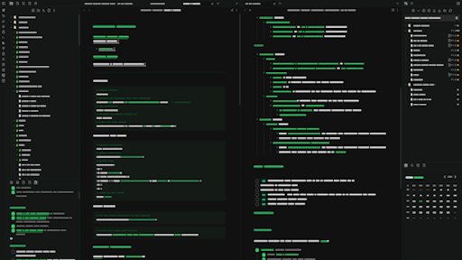

# Terminal2K

  
  
 💚 Crafted with passion for the Obsidian community 💚 

  

    
  

## Step Back in Time, Power Up Your Productivity

Craving a departure from the ordinary? Yearning for the focused simplicity of a classic command-line interface? **White Prompt** injects that iconic monochrome aesthetic, with vibrant green accents, straight into your Obsidian workflow.

This theme is meticulously crafted to provide a distraction-free writing and organizing experience, echoing the legendary terminals of yesteryear with its crisp white text on a deep black background and highlighted with electric green for emphasis on **bold**, *italic*, and `inline code`.

## Key Features You'll Love

  

* **Authentic Retro Look:** Immerse yourself in a genuine terminal feel with sharp white text against a pure black backdrop.
* **Enhanced Focus:** A clean, minimal design to laser-focus your attention on what truly matters.
* **Optimal Readability:** Carefully chosen fonts and sizing ensure comfortable reading for extended sessions.
* **Seamless Obsidian Integration:** Works flawlessly with all your favorite Obsidian features.
* **Continuous Evolution:** Expect ongoing updates and improvements, driven by community feedback!

## Ready to Command Your Notes with a Retro Flair?

To install the theme:

- Open Obsidian Settings
- Go to `Appearance` and click `Manage`
- Under community themes search for "Terminal2K" and click `Use`

Enjoy!✨

